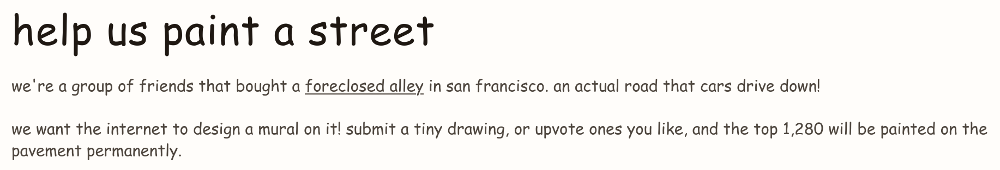
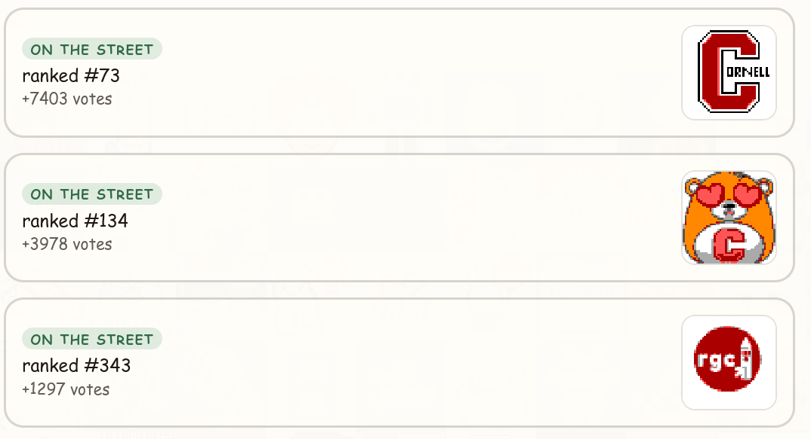

#

The website [https://paintastreet.com/](https://paintastreet.com/) has been making the rounds on the internet and in tech communities for the past few days. For those that haven't heard, this is what the website says about this project:

# Cornell University on paintastreet

I was the sole maintainer of Cornell University's three tiles that made it to the final mural. Unforunately, I was busy for much of the weekend and simply could not spend enough time developing a bot that could efficiently get past the ratelimiting consistently. I won't go into the technical details (as I haven't had the time to fully investigate the website myself), but I was really only able to upvote the Cornell tiles in the first two days. After that, I was pretty dormant since the Cornell tiles were pretty safe anyways.

Here are the final three tiles that represent Cornell:

A big thanks to the members of the [Cornell Rhythm Gaming Club](https://www.instagram.com/cornellrhythm/) and the Cornell University Discord for manually upvoting and helping out. Much of the later botting scripts I used were developed by my close friend, [AshOnDiscord](https://github.com/AshOnDiscord/).

# Some more stuff

While we were unable to claim any top spots, we did tie CMU for the _most_ university representation, both of us having 3 tiles that represent our respective universities.

By pure coincidence, a (very poorly colored) image of my face is right above the Cornell RGC logo:

This means my face will be painted on a street in SF! How cool!

Finally, Cornell is the 7th highest university tile on paintastreet!
