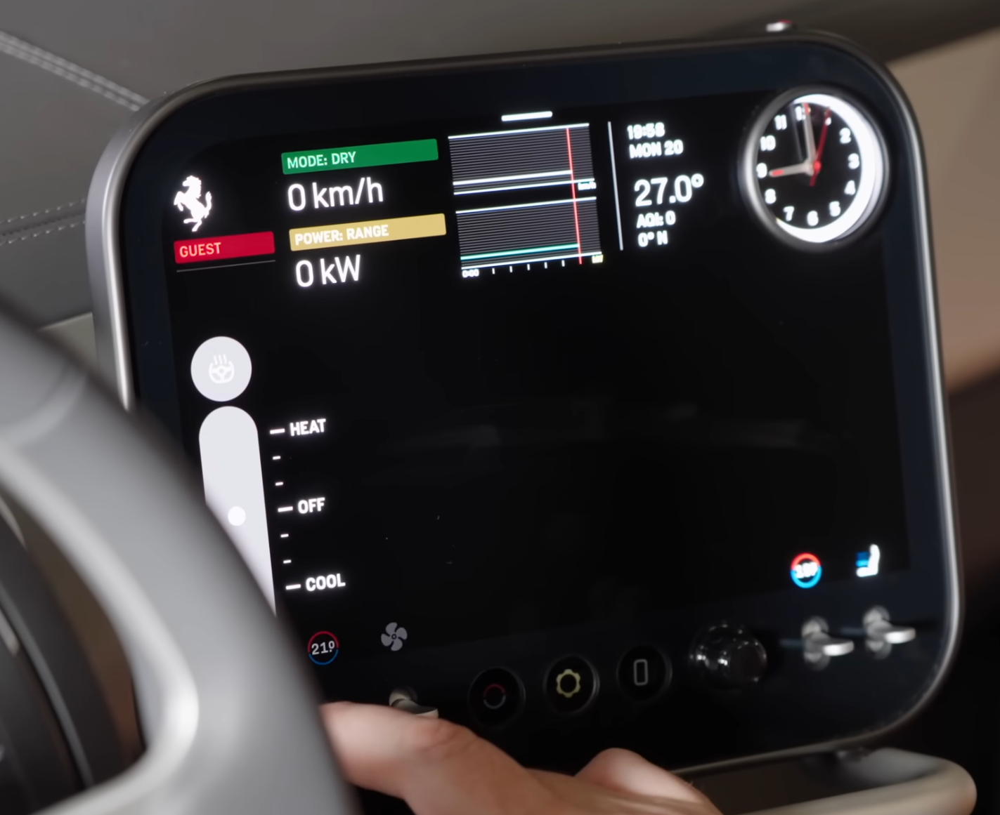

#

I hate Teslas. I hate Rivians. I hate newer Subarus, Toyotas, Fords, whatever the company. I hate any car with a touchscreen.

#

Ok, maybe hate is a strong word, but at least I strongly dislike these new cars. When did automotive manufacturers think putting an unwieldy, dusty, and grease-attracting piece of glass in the car was a good idea? I _want_ to feel the tactile bump and response of buttons, dials, switches, knobs. A screen in a car should be small and minimal.

I drive a 2014 Subaru Outback. It has a screen smaller than the size of my hand and has the very basics: music/radio information and a primitive backup camera. It is perfect. The screen stays grease-free and clean because all the navigation is done with physical buttons on the side. The buttons are direct and to-the-point. No need to fiddle around with some half-assed "car os" that requires me to press 5 buttons to get to the radio.

My car controls and settings are dispersed as buttons on the steering wheel, in my left leg area, in the center console, above my head, and on the steering wheel stalks. Sure, the car doesn't have any of the new features like X-Mode, but there is also _so_ much more room that for more buttons and switches.

A screen in the car should be used for _display_ only. It should not have to be touched or manipulated with your fingers.

On this note, I believe the [Ferrari Luce](https://www.ferrari.com/en-EN/auto/ferrari-luce) does interior design very well. It is modern with a sleek and large screen _but_ most of it is controlled with the analog controls on the bottom. While it is still a touchscreen, this is a good step in the right direction.

Touchscreens are unsafe. Physical buttons build muscle memory. I can reach with one hand to feel my way across the controls because I have a mental map of the interior of my car. I know how many buttons across from the left the air-recirculation button is, so I can reach over and press it with my eyes on the road. This would not be possible with a touchscreen.

I apologize for the unorganized rant, it is midnight and I needed to get this _very_ strong opinion of mine out there.
