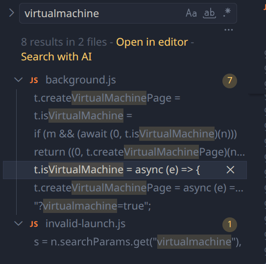

# Bypassing CollegeBoard's Lockdown Browser - A comedy of failed obfuscation and VM detection

> THIS BLOG POST IS ONLY FOR RESEARCH & EDUCATIONAL PURPOSES!

#

An anonymous friend and fellow CTFer from another school recently contacted me about a "CollegeBoard Lockdown Browser," a Chrome extension installed on their district's school Chromebooks. When triggered, it would open a completely locked-down browser that only displayed the AP Classroom exam, disabling all other functions of the computer (alt-tabbing, screenshots, etc). As with any good security researcher, he was curious just how the extension did all of this (and more importantly, how to bypass such security measures).

Now, I hate CollegeBoard as much as the next student, so I decided to take a look for myself.

# Using a VM

I would like to note the extension is completely bypassable by just... running a ChromeOS virtual machine. The extension will lock down the VM but leave the rest of your computer usable, so...

# Getting past the VM detection

My friend sent the extension to me _because_ he noticed CB had added anti-VM measures recently. So, all I had to do was figure out how the extension detected a VM, and see if I could get around it. I was pretty confident it would be a easy bypass as there are just so many things you can do with Javascript and a measly extension.

The extension can be found here: [LockDown Browser: AP Classroom Edition](https://chromewebstore.google.com/detail/lockdown-browser-ap-class/djpknfecbncogekjnjppojlaipeobkmo). I remember my friend telling me the extension & Lockdown Browser (which I will abbreviate as LB) also works on Windows and macOS computers, so I didn't think it relied on any ChromeOS-specific internals.

With Chrome extensions, I used [a CRX extractor](https://robwu.nl/crxviewer/) to download the extension's (obfuscated) src.

# Finding the anti-VM code

Doing a folder-wide search in VSCodium for the keyword "virtualmachine" reveals the function `isVirtualMachine`, which simply opens an invisible WebGL canvas and checks for the renderer. If the renderer reports back as _exactly_ "VMware Inc., SVGA3D" or "Mesa, virgl", a VM is detected and the extension refuses to start the test.



```js
t.isVirtualMachine = async (e) => {
  const t = ["VMware Inc., SVGA3D", "Mesa, virgl"],
    a = new OffscreenCanvas(100, 100).getContext("webgl");
  if (a) {
    const o = a.getExtension("WEBGL_debug_renderer_info");
    if (o) {
      const r = a.getParameter(o.UNMASKED_RENDERER_WEBGL).toLowerCase();
      if (
        (e && (await e.addToLogs(`UNMASKED_RENDERER_WEBGL: ${r}`)),
        t.some((e) =>
          a
            .getParameter(o.UNMASKED_RENDERER_WEBGL)
            .toLowerCase()
            .includes(e.toLowerCase()),
        ))
      )
        return !0;
    }
  }
  return !1;
};
```

Using [webglreport](https://webglreport.com/) we can confirm using the standard

```
qemu-system-x86_64 -drive format=qcow2,file=chromeosflex.qcow2 -m 8G -smp 2 -enable-kvm -display "gtk,gl=on,show-cursor=on" -device virtio-vga-gl -usb -device usb-tablet
```

to start the VM results in  "Mesa, virgl" being reported.

# Bypass

We can easily get around this by changing the virtualized GPU device that QEMU uses to `virtio-vga`:

```
qemu-system-x86_64 -drive format=qcow2,file=chromeosflex.qcow2,cache=writeback -m 8G -smp 4 -cpu host -enable-kvm -display gtk,gl=on,show-cursor=on -device virtio-vga -usb -device usb-tablet
```


The drawback is this _does_ get rid of hardware accel, so performance will be a bit worse and you may see some visual artifacts in the VM. Nothing should be unusably bad, however.
