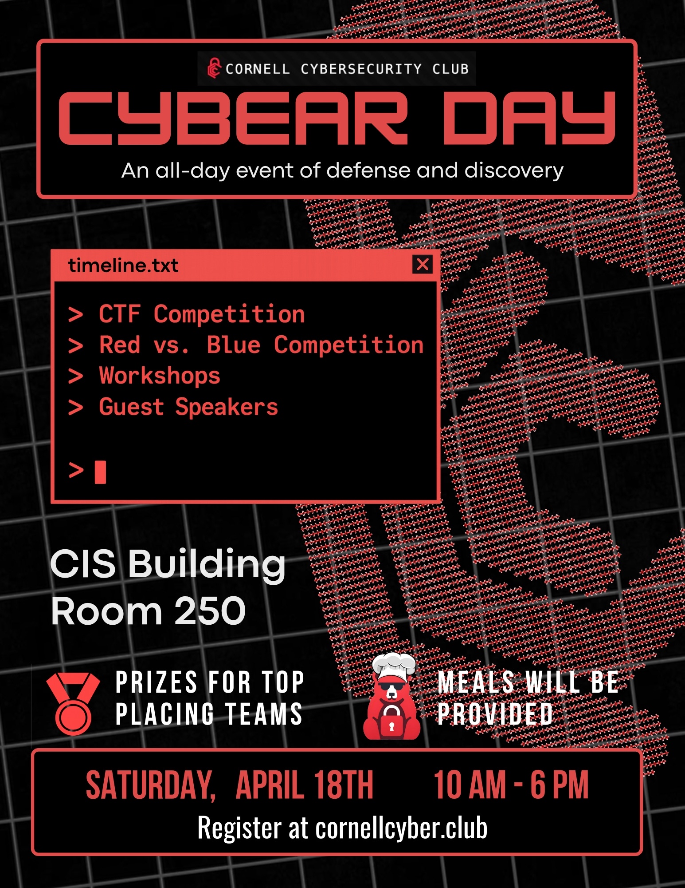

<!-- ---
title: "Cybear Day 2026 - toyRNN"
pubDate: 2026-04-20T22:00:00-04:00
description: "Cybear Day 2026 - toyRNN Writeup"
author: "internetguy"
layout: ../../../../layouts/DefaultLayout.astro
---

# Cybear Day 2026 - toyRNN

For [Cornell Cybersec's](https://cornellcyber.club/) 2026 CTF and cybersec day, I wanted to try making a chall for others to play! Because I was quite busy with other things in life (AP exams are coming up!) I went with an AI model exploitation challenge which I was already the most comfortable with.

# The Idea

Having done simple model inversion/gradient ascent challs in the past, I wanted my chall to be slightly more interesting/involved. Recently having read a paper on the [HotFlip exploit](https://arxiv.org/abs/1712.06751) (which I found fascinating), I wanted to try and incorporate that. Without forcing you to read the paper, HotFlip is an exploit that allows the attacker to craft an input for a neural text classifier -->
